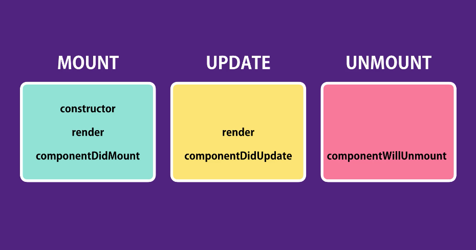

# CodeWithMosh_JS_MasteringReact

repo for learning react on codeWithMosh

### 1. Getting Started - Your First React App

```

~1. $ react-create-app <String>app_name~ (depreciated)
1. $ npx create-react-app <String>app_name
2. $ cd <String>app_name
3. $npm start
```

### Structure

This React is front-end focused. For JS with backend, check out the **nodeJs** course :)  
Also checkout **"JS basics for beginners"** and **"Object-oriented programming in JS"** to make you a better coder in JS.

### 2. ES6 Refresher

Here are some basic concepts that you shall know about JS.


// var -> function  
// let -> block  
// const -> block (~like final, make it read only)

#### this

The value of `this` is determined by how a function is called.

```javascript
let person = {
  name: "Mosh",
  walk() {
    console.log(this);
  },
  talk() {},
};

person.walk();
const walk = person.walk;
walk();
```

If it calls a function as a method of an object, `this` will always return a reference of that object.

However, if you call a function as a standalone object or outside of an object, `this` will return the global object (which is the current window, or undefined in the restricted mode).

You can fix it with the `bind()` method.

```javascript
const walk = person.walk.bind(person);
walk();
```

Notice that... in Javascript, a method/function CAN be an object.

### 3. Component

Here we learnt about several important concepts to build complex components:


> Tips
>
> 1. find templates from searching in bootstrap website.
> 2. Zen-coding shortcut to generate complex markup for us quickly:
>
> ```
> table.table>thead>tr>th*4
> ```

### 4. Composing Component

1. `props` vs. `state`:
   `props` = data that we give to a component. And it is **READ** only!
   `state` = data that is local and private to that component.

2. React App LifeCycle:
   
