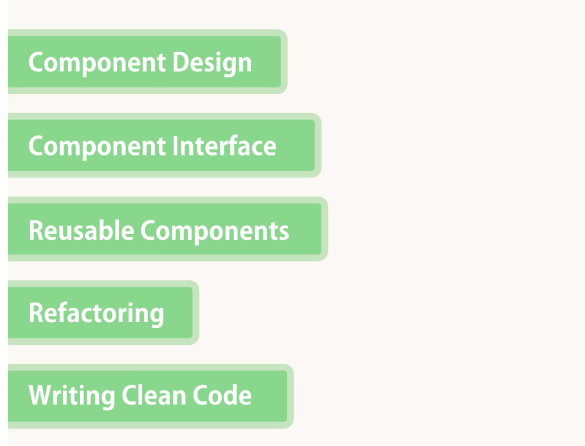

# CodeWithMosh_JS_MasteringReact

repo for learning react on codeWithMosh.

react = a lightweight library for building UIs (render the view and manage the DOM)

## Environment Setup

```bash
npm --version
node -v
npm i -g create-react-app@1.5.2

# for calling back end
npm i axio@0.18

# for better notification
npm i react-toastify@4.1
```

### 1. Getting Started - Your First React App

```
~1. $ react-create-app <String>app_name~ (depreciated)
1. $ npx create-react-app <String>app_name
2. $ cd <String>app_name
3. $npm start
```

### Structure

This React is front-end focused. For JS with backend, check out the **nodeJs** course :)  
Also checkout **"JS basics for beginners"** and **"Object-oriented programming in JS"** to make you a better coder in JS.

### 2. ES6 Refresher

Here are some basic concepts that you shall know about JS.


// var -> function  
// let -> block  
// const -> block (~like final, make it read only)

#### this

The value of `this` is determined by how a function is called.

```javascript
let person = {
  name: "Mosh",
  walk() {
    console.log(this);
  },
  talk() {},
};

person.walk();
const walk = person.walk;
walk();
```

If it calls a function as a method of an object, `this` will always return a reference of that object.

However, if you call a function as a standalone object or outside of an object, `this` will return the global object (which is the current window, or undefined in the restricted mode).

You can fix it with the `bind()` method.

```javascript
const walk = person.walk.bind(person);
walk();
```

Notice that... in Javascript, a method/function CAN be an object.

### 3. Component

Here we learnt about several important concepts to build complex components:


> Tips
>
> 1. find templates from searching in bootstrap website.
> 2. Zen-coding shortcut to generate complex markup for us quickly:
>
> ```
> table.table>thead>tr>th*4
> ```

### 4. Composing Component

1. `props` vs. `state`:
   `props` = data that we give to a component. And it is **READ** only!
   `state` = data that is local and private to that component.

2. React App LifeCycle:
   

### 5. Pagination, Filtering, and Sorting

This is one of the most interesting, practical and also difficult section.  
In there we:

1. Added pagination for the `vidly` project. (using lodash to slice; calculate based on number of movies and show # per page; then generate paged items on the fly.)
2. Added filtering of movies based on genre. (update the filter selection; lead to re-render page with new filtered movies)
3. Made filtering work together with pagination. (have pagination happen after filtering)
4. Added sorting (by column). (adding onclick to table column names; use lodash to sort and return new list of movies to re-render)
5. Made sorting work with filtering and pagination.
6. Added icons for sorting, and highlights for filtering.
7. On top of that, Mosh also tried to encapsulate the code as much as possible.

   

### 6. Routing

1. setup:

```bash
# first we need to install a routing package for react
npm i react-router-dom@4.3.1

# then we need this for query string parameters
npm i query-string@6.1.0
```

2. magic :

```
ul>(li>Link[to=''])*3

Route[path][component]*4
```

### 7. Forms

For easier validation.

```bash
npm i joi-browser@13.4
```

### 8. Search bar

(Exercise 3 of the "Form" Chapter)

Here we didn't use the `useState` hook. Instead, we utilize the old getPagedData function, such that whenever the `input` element of the searchBox.jsx is changed, the `onChange={(e) => onChange(e.currentTarget.value)}` will trigger and then change the associated `state` (more specifically, the `searchQuery` element in the `state`.)

And here is the a bit ??confusing?? part: react seems will notice this change and call the `getPagedData` again and inside which we will update the `filtered` variable and thus update the searching result.

detail see [this commit](https://github.com/tobyatgithub/CodeWithMosh_JS_MasteringReact/commit/1e8334a74d8271d050d770f2cd7097eb96d84036)

### 9. Calling Backend and JSON placeholder

Downloaded chrome extension `JSON view`.

### 10. exporting method like a library

Check out the `httpService.js` in the http-all/services/ folder.

Multiple benefits for doing that:

1. clears the code (so that we don't expose many `error.response.status` stuff).
2. make the code more portable and reuseable - anywhere else inside the project.
3. easier to maintain - if we decide to replace axios by something else, that file is the only place we need to make a change.

Interesting how easy it is to export by wrapping around existing functions (e.g. `get: axios.get`) and how by doing this it will recognize the `INTERCEPTOR` immediately!

### 11. better notification with toastify

```bash
npm i react-toastify@4.1
```

### 12. logging your logs

Here we use sentry.io as the error logging service.

```bash
npm install --save @sentry/react @sentry/tracing
```

Follow the instructions and it worked (different from the video.) Notice that you will need to turn the ad-blocker off to make it work (lol).

And... free 2month sign-up with programmingwithmosh.com/tools
